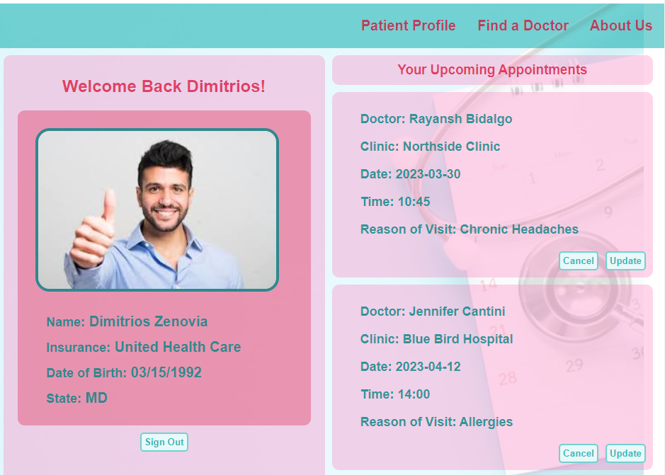

# **PATIENT PATHWAY**

## **_Table of Contents:_**

1. Collaborators
2. Motivation
3. Project Description
4. Technologies Used
5. Future Updates
6. Credits

## **_Links:_**

[Front End Repository](https://github.com/trumanmiller20/Patient-Pathway-PERN)

[Back End Repository](https://github.com/trumanmiller20/Patient-Pathway-PERN-Backend)

[Entity Relationship Diagram](https://drive.google.com/file/d/1dc2QBlzhGx3we0ETleQ6cqfRoTofMX_z/view?usp=sharing)

[Component Hierarchy Diagram](https://drive.google.com/file/d/1FLH9COKGH6CTPRAdueu4HAo-XghX1TdP/view?usp=sharing)

---

## **_Collaborators_**

|       Name       |                                                                GitHub                                                                 |                                                                        LinkedIn                                                                         |
| :--------------: | :-----------------------------------------------------------------------------------------------------------------------------------: | :-----------------------------------------------------------------------------------------------------------------------------------------------------: |
| Brandon Partrick |        |             |
|  Joshua Jumelet  |     |               |
| Hatice Yorukoglu |        |  |
|  Truman Miller   |  |     |

---

### **_Motivation_**

Our motivation for this collaborative project was to refine our programming acumen; building on our existing knowledge of React, Express, and JavaScript, while integrating the additional technologies of the PostgreSQL database, and user authentication methods. We accomplished this together after only eight weeks of instruction enrolled in General Assembly's Software Engineering Immersive program.

---

### **_Description:_**

This PERN stack application provids a simple healthcare platform for users. The user can create a patient profile, select a physician, make an appointment with that physician, and view existing appointments.

---

### **_Technologies Used_**

- [TRELLO Board](https://trello.com/b/DQ0A8xV5/patientpathway)
- HTML
- CSS
- JavaScript
- React.js
- Express.js
- Node.js
- PostgreSQL

---

### **_Future Updates_**

1. Sort existing appointments by date
2. Model for (patient payment/reviews)
3. UI Library
4. External API (doctors/insurance)
5. Data Visualization options
6. Navigation bar renders on login
7. Doctor authentication
8. Update user profile

---

### **_Credits:_**

- Trello
- MDN Web Docs
- W3 Schools
- Geeks for Geeks
- Google Fonts
- LucidApp
- draw.io
- Pexels.com
